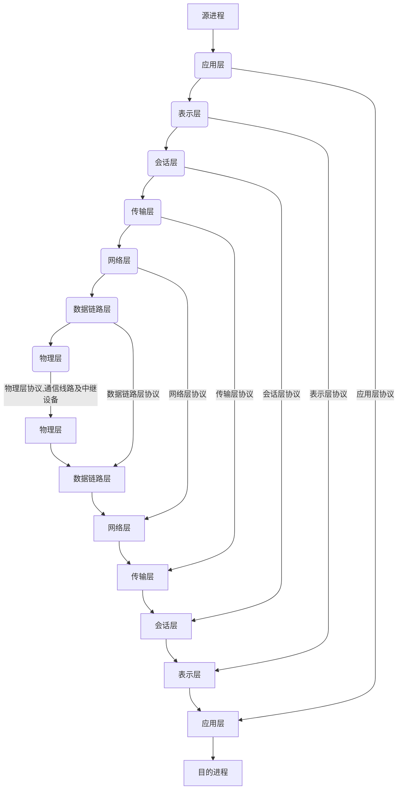

### 2.2 OSI参考模型

​	Iintemnet是一个极为复杂的系统，有大量的应用程序和协议、各种类型的端系统。我们可以利用分层结构，只要该层对其上层提供相同的服务，并且使用来自下层的相同服务，当某层实现变化时，该系统的其余部分就可以保持不变。在计算机网络发展的早期，一些大的计算机公司在开展计算机网络研究和产品开发的同时，纷纷提出各种网络体系结构与网络协议。缺乏国际标准将会使技术的发展处于混乱状况，目竞争的结果可能形成多种技术体制并存在不兼容的状态，给用户带来不便。
​	在制定网络国际标准方面，国际标准化组织(ISO)提出了著名的“开放系统互联”(OSI)参考模型，采用分层结构描述网络功能结构。但OSI参考模型并没有提供一个可以实现的方法，只是描述了一些概念，用来协调进程间通信标准的制定。

#### 2.2.1 OSI层次结构

​	OSI包括体系结构、服务定义和协议规范三级抽象。OSI的体系结构定义了一个七层模型，用于进行进程间的通信并作为一个框架来协调各层标准的制定;OSI的服务定义描述了各层所提供的服务，以及层与层之间的抽象端口和交互用的服务原语;OSI的协议规范，精确地定义了应当发送何种控制信息及何种过程来解释该控制信息。层次结构助记方式如图2-1所示。
​	**OSI参考模型将系统分成了七层，从下到上分别为：**

物理层(PhysicalLayer，PHL)、数据链路层(Data LinkLayer，DLL)、网络层(Network Layer，NL)、传输层(Transport Layer，TL)、会话层(Session LayerSL)、表示层(Presentation Layer，PL)和应用层(Application Layer，AL)，如图2-1所示。

**图2-1所示**

##### 1.物理层

​	物理层提供相邻设备间的比特流传输。利用物理通信介质，为上层(数据链路层)提供一个物理连接，通过物理连接透明地传输比特流。
所谓透明传输，是指经实际电路后传送的比特流没有变化，任意组合的比特流都可以在这个电路上传输，物理层并不知道比特的含义。物理层要考虑的是如何发送“0”和“1”，以及接收方如何识别。

##### 2.数据链路层

​	数据链路层负责在两个相邻的节点间的线路上无差错地传送以帧为单位的数据，每帧包括一定的数据和必要的控制信息，在接收方接收到数据出错时通知发送方重发，直到这一帧无误地到达接收方。数据链路层就是把一条有可能出错的实际链路变成让网络层看来好像不出错的链路。

##### 3.网络层

​	网络中通信的两个主机之间可能要经过许多个节点和链路，还可能经过几个通信子网。网络层数据的传送单位是分组(Packet)，网络层的任务就是要选择合适的路由，使发送方的运输层发下来的分组能够正确无误地按照地址找到接收方并交付给接收方的运输层，这就是网络层的寻址功能。

##### 4.传输层

​	传输层的任务是根据通信子网的特性最佳地利用网络资源，并以可靠和经济的方式为两个端系统的会话层之间建立一条传输连接，透明地传输报文。
传输层向上层提供一个可靠的端到端服务，使会话层不知道传输层以下的数据通信的细节。

##### 5.会话层

​	会话层虽然不参与具体的数据传输，但它对数据进行管理，向互相合作的表示进程之间提供一套会话设施，组织和同步它们的会话活动，并管理它们的数据交换过程，

##### 6.表示层

​	表示层向应用进程提供信息表示方式，使不同表示方式的系统之间能进行通信。表示层还负责数据的加密和压缩

##### 7.应用层

​	应用层为应用程序提供服务以保证通信，主要为软件提供端口，让软件程序能使用网络服务

### 2.3 TCP/IP体系结构

​	OSI参考模型是国际标准化组织为了实现设备互联而提出的一个纯理论的框架性的概念。因为OSI参考模型的网络模型标准比较严格、过于复杂，另外推出的时间也相对较晚，所以目前还没有完全按照OSI参考模型实现的网络。而随着Internet的迅速发展，TCP/P体系结构开始普及，是我们实际应用最广泛的一种网络模型，
​	**TCPIP协议簇也是一种层次体系结构，共分为4层**，其中底层物理层和数据链路层只需支持网络互联层的分组传送即可，因此作为网络端口层来对待。从层次结构的角度出发，TCP/IP体系结构模型如下表所示。

| OSI/RM   | TCP/IP       |
|:--------:|--------------|
| 应用层   | 应用层       |
| 表示层   |              |
| 会话层   |              |
| 传输层   | 传输层       |
| 网络层   | 网络端口层 |
| 数据链路层 | 网络接口层   |
| 物理层   |              |

#### TCP/IP体系结构各层的功能简介如下。

​	**网络端口层**:提供IP数据报的发送和接收。该层使用协议为各通信子网本身固有的协议，如以太网的802.3协议、令牌环网的802.5协议及分组交换网的X25协议等
​	**网络互联层**:提供计算机间的分组传输。高层数据的分组生成:底层数据报的分组组装;处理路由、流控、拥塞问题。IP协议提供统一的地址格式和IP数据报格式，以消除各通信子网的差异，从而为信息发送方和接收方提供透明通道。
​	**传输层**:提供应用程序间的通信。格式化信息流;提供可靠传输。TCP提供面向连接的可靠的字节流传输;UDP提供无连接的不可靠的数据报传输。
​	**应用层**:提供常用的应用程序。应用层协议主要有HTTP、FTP、SMTP、POP3、TeInet、DNS、SNMP、RIP、DHCP等。其中HTTP、FTP、SMTP、POP3、Telnet的传输层承载协议是基于TCP的;DNS、SNMP、RIP、DHCP的传输层承载协议是基于UDP的。